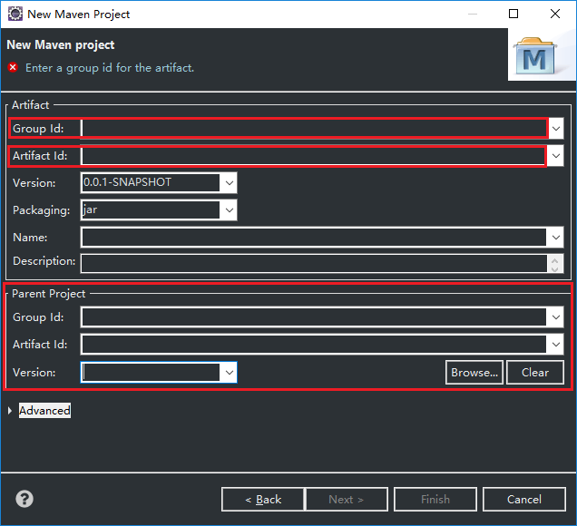

### spring学习之旅一 配置并使用Maven

#### 了解 Maven
Maven是

#### 在eclipse中使用Maven

##### 将Maven导入eclipse
Eclipse for JEE 版本中内置了一个Maven，不过这是一个比较老的版本，并不是十分的好用，一般都是把从Maven官网下载的Maven导入到Eclipse中。

接下来就详细介绍将Maven导入Eclipse中。

1）. 打开 **Preferences** 窗口。在菜单栏中点击 Window ，接着点击 Perferences 菜单项，此时会出现 Perferences 窗口。

2）. 在 Perferences 窗口左侧的树形视图中找到并展开 **Maven** 节点，点击 **Installations**，右侧会刷新出相关的视图。此时可以看到已经安装的Maven的列表，没有加入新的的话应该是有两个。

3）. 点击列表右边的 Add... 按钮，会弹出一个标题名为 **New Maven Runtime** 的窗口，点击中间的 **Directory...** 按钮，在弹出的窗口中选择你的Maven解压的根目录，选中后点击**Finish**。

4）. 在 Perference 窗口右侧的列表中可以看到新添加进来的Maven。为了让它起作用，我们点击前面的方框，让它被选定（方框中出现对勾），然后点击 Apply 按钮。

至此外部 Maven 就成功导入到eclipse中，但是要让它起作用（创建Maven项目）还要设置 User setting

##### 设置 Use Setting
在上一步的 Preferences 窗口中，找到 Maven 节点下的 User Setting ，右边的视图会出现如下图所示的变化。

需要配置的是 **Global Setting** 和 **User Setting** 和 **Local Repository**。

通常是将 Global Setting 设置为 maven 根目录下 conf 文件夹内的 setting.xml

将 User Setting 设置为 拷贝到 .m2 目录下的 setting.xml。

> .m2 的默认存放目录是 **C:/用户/用户名/.m2**，.m2 目录内的 repository 文件夹是maven下载的jar报的存放目录。

设置好后可以点击 **Update Setting** 按钮告诉系统我要更新 settings，使设置生效。

Local Repository 设置的是 repository 的存放目录，如果不设置的话就会使用默认目录 `C:/用户/用户名/.m2`，我的习惯是把 .m2 目录设置为和maven根目录的上级目录同级。
未设置的话Local Repository点击文本输入框即可设置。

设置好 Maven 后，接下来就要创建 Maven 项目。

##### 创建简单Maven项目

在包视图浏览器（Package Explorer）中点击鼠标右键，选择** new -> Maven Project**。

如果没有的话可以选择 **others** ,在弹出的窗口的文本框中输入 "maven" 过滤选项，选择 **Maven Project** 

点击next，在 New Maven project 窗口中点击选定 `create a simple project(skip archetype selection)` 跳不跳过很重要。对于初学者来说，最好选择这一项，从最简单的开始。

点击 next,出现如图所示的窗口。

**Group Id** ,**Artifact Id**,这两个 Id 用于在一个组级的仓库中定位某个具体的jar包。

一般来说，**Group Id** 指的是项目组（相对来说稍微大一点），**Artifact Id** 指的是项目组中具体的某一个功能模块，和项目有关系。

name（项目的名字），Description（介绍）想要写就写，不写也无所谓。

**Parent Project** 是与 Maven Module 相关的，说明依赖于哪个项目。如果有依赖，就写上。

点击 finish ，完成新建 Maven 项目。

在Package Explorer中，展开项目，会有四个源文件夹（图标是文件夹上面一个包的那种）。

##### 转换项目为web项目

创建项目时选择的是创建简单的项目，因为后面会用到SpringMvc相关的，所以可以在这里先把项目转换为一个Web项目，具体的步骤是：在项目名称上点击右键，唤出上下文菜单，选择 **properties**，在打开的窗口左侧的树形图中找到 **Project Facets**。在没有转换项目之前，他的样子应该是如图所示的样子。

鼠标左键点击上图中标示出来的蓝色字体类似超链接的文本，会出现如下图所示的变化，选中列表中的 **Dynamic Web Module** 。如果可以的话，可以将 版本改成 3.0 或 3.1 。

改为web项目之后会在下方出现 **Further congfiguration avaliable**字样，点击设置HTML文件等的前端文件的放置目录，通常是设置为 **src/main/webapp**。** Generate web.xml deployment descripter** 不用点选，因为是 Dynamic Web Module 3.0 以上版本，可以不用使用 **web.xml**。

最后不要忘了点击 **Apply** 按钮。

##### 

##### pom.xml文件

在搜索引擎中键入 "mvn" 得到的第一个词条是如下图所示的网站，该网站收集了大多说的jar包 dependency 依赖选项。

